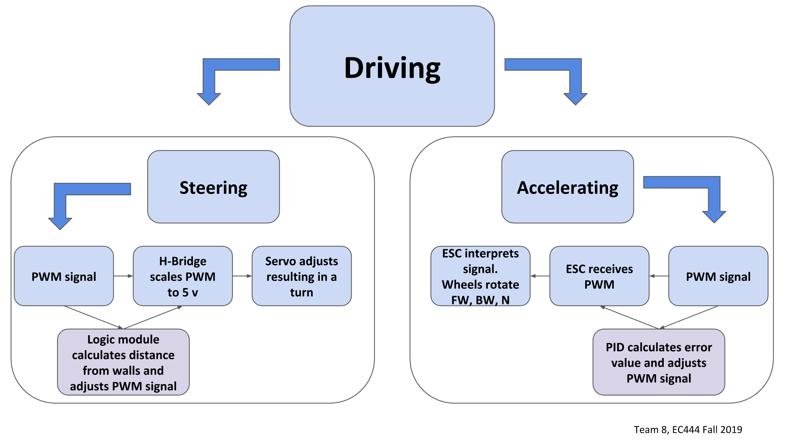
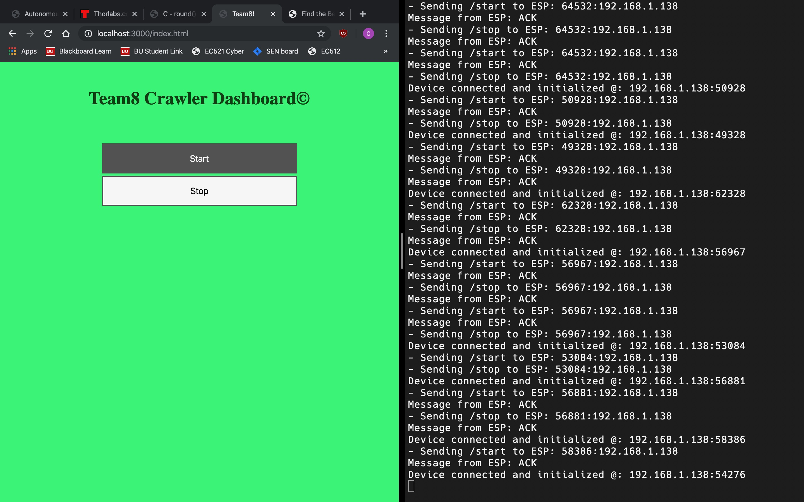
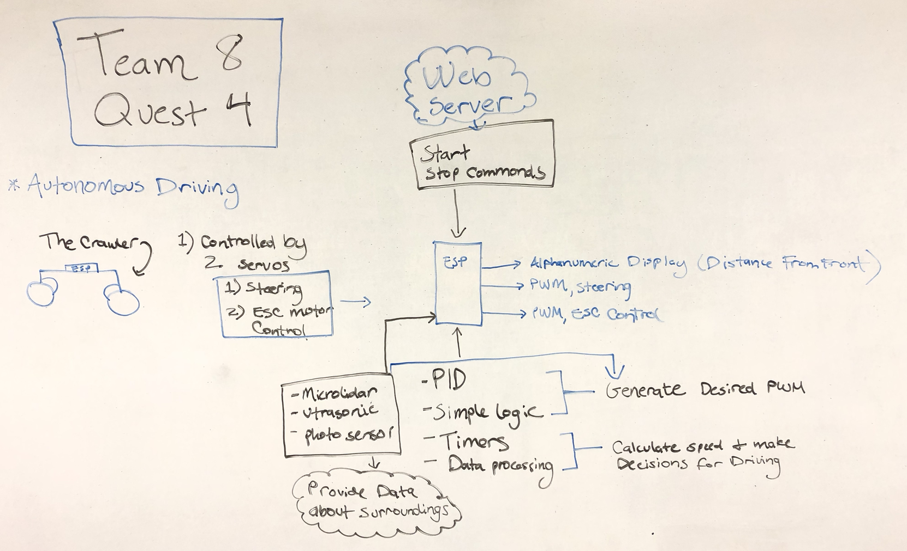
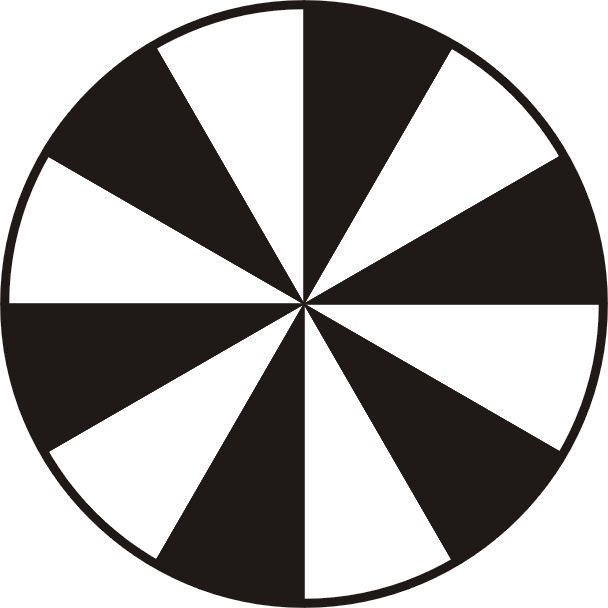

# Autonomous Driving Foundation
Authors: Chase Clarke, Megan Heydari, Leila Lee
2019-11-07

## Summary
This quest, the Autonomous Driving Quest, requires us to configure our crawler to interact with the ESP32 microcontroller in order to drive itself.

The crawler is equipped with sensors on the right side as well as the front in order to determine range from objects as it moves in the forward direction. We used a total of 3 sensors on the body of the crawler. 1 ultrasonic in front and 2 microlidars on one side.

There is a fourth and final sensor in addition to the ranging sensor. This sensor is the photo LED sensing pair. This device  allows us to measure the speed that our crawler moves at based on revolutions per minute. A simple measurement of the circumference of the wheel allows us to convert this to meters per second, a measurement most of us are more familiar with.  

Finally, the crawler also is able to be controlled wirelessly, through a web and UDP server. By our ESP32 with wifi via our router, we are able to send it Start and Stop signals from the ease of our computer.

## Evaluation Criteria

-Must use PID control for maintaining center of track
  - This is no longer a requirement. Instead, we use simple logic to hard code so that the angle that the crawler drives is parallel to the wall at all times. If the crawler starts turning toward the wall, the angle will change and the steering servo will adjust.

-Must use PID control for maintaining speed of 0.1 m/s after start and before stop
  - This requirement was also changed. Going at a speed this low was a limitation for our crawler. With the speed limit increased, our crawler is able to abide by it. Using a PID control module, the crawler accelerates and caps out at around 0.4 m/s.

-Must stop within 20 cm of end of track without collision
  - We fulfilled this requirement by using an ultrasonic sensor at the front of our crawler. The ultrasonic sensor is only accurate between the range of 30 cm to 5 m. This was no problem for us, as we set the ultrasonic sensor back a bit on the acrylic of our crawler so that when it detects 30 cm, the front of the crawler will be within 20 cm.

-Start and stop instructions should be issued wirelessly through laptop
  - Using a web and UDP server and our router, we are able to communicate with the ESP32 through wifi to Start and Stop the crawler ESC from the laptop.

-Must display speed or distance information to alpha display
  - We use the alphanumeric display and i2c protocol to display the distance that the crawler is away from the objects in front of it, using data from the ultrasonic sensor.

-------------------------------------------------------------------------------------------------------------------------
*Update on Rubric for Driving*
Updates:

- A PID controller is not required for the steering. (Rubric will be to hold the center of the track +/- 25cm)
- For the speed PID, you can use a set point in the range of 0.1 to 0.4 m/s

## Solution Design
Our autonomous driving crawler uses the following **hardware**:
  - Crawler (obviously) minus the remote
  - ESP32
    - This makes decisions for the crawler based on the data it receives from the sensors observing its surroundings.
  - 1 Ultrasonic sensor
    - Measures the distance of the front of the crawler from obstacles in front of it. We decided to use the ultrasonic sensor for a couple of reasons. One reason was that we really disliked working with the lidar lite because all of the wires on the connector to our device kept breaking. Another reason was that working with i2c devices can be cumbersome. Most importantly, we noted that the ghoul in the pumpkin smash quest was creating problems for groups that used lidar to detect obstacles around the crawler because lidar does not work with translucent or transparent surfaces, as the laser or light passes through. The ultrasonic sensor uses ultrasonic waves to measure distance. Transparency does not affect ultrasonic waves, as they do not depend on light. As a result of our forward facing ultrasonic sensor, our crawler should be able to stop in the presence of transparent surfaces, like glass windows and ghouls.
  - 2 MicroLidar sensors
    - These sensors are on one side of the crawler and detect obstacles that the crawler might encounter. We used a simple logic of using the error (the difference of the two sensor value) and adjust the steering in accordance. The magnitude of the steering is calculated by setting the distance between the two sensors as a set point of full steering range to one direction since the full error is the same value when the two sensors are aligned. The actual magnitude used is the full range of steering motion divided by the set value and then multiplied by the error. Any value higher or lower than that value would adjust the steering to the maximum degree on the corresponding direction. 
  - 1 Photo LED Sensor
    - Set up on one for the rear, non-turning wheels, in order to measure the revolutions of the wheel per unit of time.
  - H- Bridge
    - Scales the PWM signal from 3.3v to 5v to accommodate the requirements of the steering servo.
  - Alphanumeric Display
    - Displays the distance from the nearest front facing object in the crawler's path.

 Our autonomous driving crawler uses the following **software**:
  - Pulse Width Modulation
    - Controls our turning and accelerating servos. The servos are incrementally to obey the laws of physics. A computer can go from 0 to 60 mph in 0 seconds, but our crawler cannot.
  - PCNT
    - Using the photosensor and a pinwheel, a pulse waveform is generated as the wheel of the crawler turns. There are 6 white stripes on the pinwheel, which means there are 6 positive edges of the generated waveform. Once 6 pulses have been counted, the wheel has turned a full revolution. Using some very simple math, the number of pulses is converted to the number of revolutions. Using the circumference of the wheel (0.62 meters), we convert the number of revolutions to a distance. The PCNT runs on a timer that we created in our code so we have a distance that corresponds to a duration of our choosing. In our case, this duration is 1 second. That is, our speed is updated every second by counting the distance in that second through revolutions and converting to meters per second.
  3. Timer
    - As mentioned above, we implemented a timer in order to measure accurate durations of time for metrics that necessitate it, such as speed.
  4. PID
    - We use PID in order to accelerate to a desired speed and then maintain that speed. For us, this speed is around 0.4 m/s. The PID control module uses proportional, integral, differential calculations to calculate an "error" value this error value helps the crawler get to its desired speed. A very simply explanation is that PID calculates an error to adjust speed, the crawler responds, the PID sees how well it did in calculating the error. If the PID did not generate a large enough error to reach the target speed, it will take into account the previous error and generate a larger error. This works for speeding up **and** slowing down. In order to get our PID function to work correctly, we had to experiment with the values of Kp, Kd, and Ki until we found that our crawler was able to speed up and slow down as smoothly and efficiently as possible.
  5. Web and UDP Server
    -  Our webserver and UDP server were both run in one nodejs file. The webserver was hosted on port 3000 and handled the client on a web browser. The client has two buttons, one for start and stop. On button press there would be a callback to a different url instructing the webserver that the client wanted the crawler to start or stop. The UDP server was hosted on port 8080 and served as a method of communication with the esp. Any time the webserver recieved a callback to the start or stop url it would pass that information on to the esp.
    
Here is a graphical depiction of the crawler's logic:

  

 

## Investigative question
Define what you would want in a better sensor for the vehicle. Be very specific in quantifying it’s performance. Please cite materials found on the web to support your response.

We found that using lidar sensors on our crawler was a significant limitation. Lidar works by shining a laser on a target and measuring the light that is reflected in order to calculate distance. Although traditionally lidar uses a laser, a lidar sensor can also work by using an LED light. This is how the microlidar that we use on the sides of our crawler work.

Lidar works fine for measuring distance; however, because it depends on reflected light, translucent and transparent surfaces will confuse the lidar by allowing the light from the laser to pass through. This will lead the crawler to believe that there is no obstacle in its way and will likely result in collisions.

One way to avoid this issue, is to use an ultrasonic sensor, maybe in tandem with the lidar, which uses ultrasonic waves in order to calculate distance. The problem with the sensor that we have is that it does not work well for distances less than 30 cm (you can see our workaround for this in the Solution Design section). Using a different and more precise ultrasonic sensor will allow one to measure smaller distances more accurately so that the crawler can get closer to its target, without touching it. A sensor that we like is the Ultrasonic Range Finder - XL-MaxSonar-EZ3, which can be purchased on SparkFun. Sparkfun states that, "the sensor provides very accurate readings from 0 to 765cm". This avoids the issue of not being able to measure small distances that our current ultrasonic sensor has.

[Lidar basic info](https://en.wikipedia.org/wiki/Lidar)

[Ultrasonic Sensor info](https://www.keyence.com/ss/products/sensor/sensorbasics/ultrasonic/info/index.jsp)

[SparkFun Ultrasonic Sensor](https://www.sparkfun.com/products/9494)

## Sketches and Photos

Our project video:

Graph of our model:

  

 

Screenshot of our web server:

  

 

In-class description of the crawler:
pinwheel we used:

  

 

Wheel setup:

  

 

\pinwheel we used:

  

 

Sensor Setup:

  

 

## Supporting Artifacts
- [Link to repo](https://github.com/BU-EC444/Team8-Clarke-Heydari-Lee/tree/master/quest-4/code)
- [Link to video demo](https://youtu.be/4V3MvFhvU2s)

## References
[Lidar basic info](https://en.wikipedia.org/wiki/Lidar)

[Ultrasonic Sensor info](https://www.keyence.com/ss/products/sensor/sensorbasics/ultrasonic/info/index.jsp)

[SparkFun Ultrasonic Sensor](https://www.sparkfun.com/products/9494)

[Espressif PCNT](https://github.com/espressif/esp-idf/tree/master/examples/peripherals/pcnt)

[Espressif MCPWN](https://github.com/espressif/esp-idf/tree/master/examples/peripherals/mcpwm)

-----

